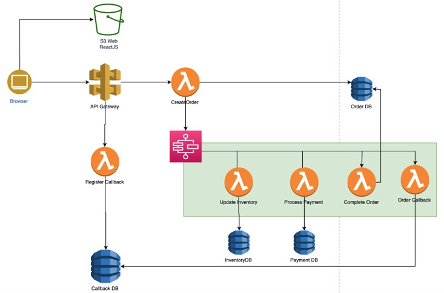

# AWSomeStore ecommerce - a microservice application


## Description
There are 2 components that need to be deployed:
- Frontend: ReactJS AWSStore app
- Backend: NodeJS Lambda services

The figure below is application architcture



## Deployment

- Deploy awsomestore frontend as S3 static website
```
    cd ./awsomepets-frontend
    aws s3 sync . s3://<BucketName> --acl public-read
```

- Deploy backend with SAM
```
    cd ./awsomepets-serverless
    sam build
    sam deploy --guided
```


